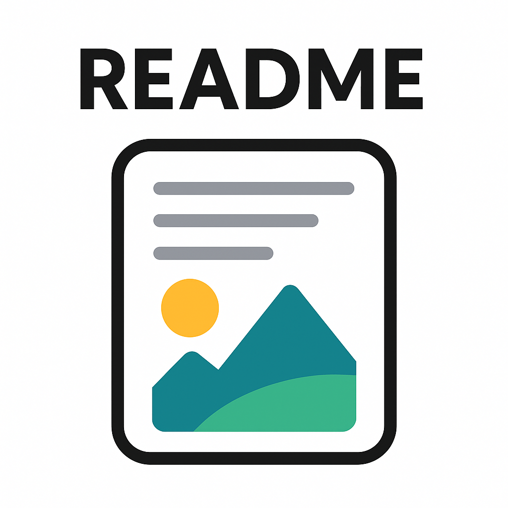

# README 파일이란?

이곳은 *저장소에 대한 설명*을 작성합니다.

**마크다운 문법**을 사용합니다.

## 깃허브 사용법

1. 원격 저장소 만들기
2. 지역 저장소 연결하기
3. 커밋하기
4. 푸시하기

깃허브 데브를 사용해 문서를 수정 중입니다.

# test-1

**깃허브 데브" 사용법**을 공부하고 있습니다.

깃허브 데브를 사용하면, 깃허브 상에서 손쉽게 코드를 수정하고 작성할 수 있습니다.

작성한 소스에 대한 간단한 소개글을 작성합니다.

여기에 원하는 내용을 입력하세요.

*마크다운 문법을 활용해서* 원하는 내용을 입력하세요.